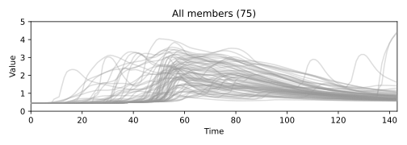
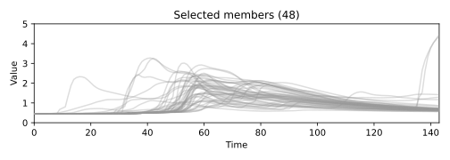
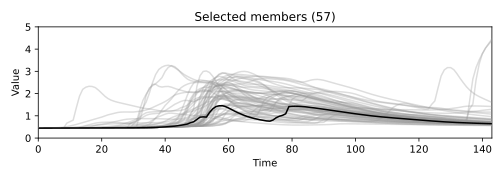

# En-EMS | *Entropy-based Ensemble Members Selection*

*en-ems* is a Python library for the selection of a set of mutually exclusive, collectivelly exaustive (MECE) ensemble members.

The library implements the approach presented by [Darbandsari and Coulibaly (2020)](http://doi.org/https://doi.org/10.1016/j.jhydrol.2020.125577) as step that antecedes the further merging of a set of ensemble forecasts.

The *en-ems* package is built over the [pyitlib](https://pypi.org/project/pyitlib/) package, which implements fundamental information theory methods.


## Installing

The library can be installed using the traditional pip:

```bash
pip install en-ems
```

And is listed on the Python Package Index (*pypi*) as [en-ems](https://pypi.org/project/en-ems/).


## Using

Suppose you have a file named ```example.csv``` with the following content:

```
Date,       Memb_A, Memb_B, ...,  Memb_Z, Obsv
2020/05/15, 1.12,   1.05,   ...,  0.5,    1.01
2020/05/16, 1.15,   1.12,   ...,  0.9,    1.10
2020/05/17, 1.13,   1.32,   ...,  1.1,    1.29
...         ...     ...     ...,  ...,    ...
2020/11/30, 1.22,   0.95,   ...,  0.3,    0.87
```

In which the columns starting with "Memb_" hold the realization of one ensemble member for the time interval and "Obsv" holds the observed values for the same time interval.

If your our objective is to select a MECE set considering obaservations, it can be done using the standard parameters by:

```python
import pandas as pd
import enems

# read file
data_ensemble = pd.read_csv("example.csv").to_dict('list')
data_obsv = data_ensemble["Obsv"]
del data_ensemble["Obsv"], data_ensemble["Date"]

# perform selection
selection_log = enems.select_ensemble_members(data_ensemble, data_obsv)
```

The variable ```selection_log``` will be a dictionary containing a log of the *total correlation*, *joint antropy* and (if an observation was given) the *transinformation* of the given and selected datasets. It also contains, as expected, the ids of the selected ensemble members.

## Example 1: No observation data available

Mock data for a dataset with 75 supposed ensemble members and without observation records can be obtained with the function ```enems.load_data_75()```.

Here is a full example on how we can access the mock data, select a MECE subset and visualize the results using the popular ```matplotlib``` is given:

```python
import matplotlib.pyplot as plt
import enems

if __name__ == "__main__":

    # ## LOAD DATA ################################################################################################### #

    test_data_df = enems.load_data_75()
    test_data = test_data_df.to_dict("list")

    # ## SELECT MECE SUBSET ########################################################################################## #

    selection_log = enems.select_ensemble_members(test_data, None, n_bins=10, bin_by="equal_intervals", 
                                                  beta_threshold=0.95, n_processes=1, verbose=False)

    # ## PLOT FUNCTIONS ############################################################################################## #

    def plot_ensemble_members(all_series: dict, selected_series: set, plot_title: str, output_file_path: str) -> None:
        _, axs = plt.subplots(1, 1, figsize=(7, 2.5))
        axs.set_xlabel("Time")
        axs.set_ylabel("Value")
        axs.set_title(plot_title)
        axs.set_xlim(0, 143)
        axs.set_ylim(0, 5)
        [axs.plot(all_series[series_id], color="#999999", zorder=3, alpha=0.33) for series_id in selected_series]
        plt.tight_layout()
        plt.savefig(output_file_path)
        plt.close()
        return None

    def plot_log(n_total_members: int, log: dict, output_file_path: str) -> None:
        _, axss = plt.subplots(1, 2, figsize=(7.0, 2.5))
        x_values=[n_total_members-i-1 for i in range(len(log["history"]["total_correlation"]))]
        axss[0].set_xlabel("Time")
        axss[0].set_ylabel("Total correlation")
        axss[0].plot(x_values, log["history"]["total_correlation"], color="#7777FF", zorder=3)
        axss[0].set_ylim(70, 140)
        axss[0].set_xlim(x_values[0], x_values[-1])
        axss[1].set_xlabel("Time")
        axss[1].set_ylabel("Joint entropy")
        axss[1].axhline(log["original_ensemble_joint_entropy"], color="#FF7777", zorder=3, label="Full set")
        axss[1].plot(x_values, log["history"]["joint_entropy"], color="#7777FF", zorder=3, label="Selected set")
        axss[1].set_ylim(6.3, 6.9)
        axss[1].set_xlim(x_values[0], x_values[-1])
        axss[1].legend()
        plt.tight_layout()
        plt.savefig(output_file_path)
        plt.close()
        return None

    # ## FUNCTIONS CALL ############################################################################################## #

    plot_log(len(test_data.keys()), selection_log, "test/log.svg")

    plot_ensemble_members(test_data, set(test_data.keys()),
                          "All members (%d)" % len(test_data.keys()),
                          "test/ensemble_all.svg")

    plot_ensemble_members(test_data, selection_log["selected_members"],
                          "Selected members (%d)" % len(selection_log["selected_members"]),
                          "test/ensemble_selected.svg")
```

Which would give us the following plot:


*log.svg*


*ensemble_all.svg*


*ensemble_selected.svg*

## Example 2:

Additional mock observation data compatible with the mock ensemble members is distributed with the package. It can be accessed using the funcion ```enems.load_data_obs()```.

An example on how to use it to trigger the full version of the algorithm can is presented:

```python
import matplotlib.pyplot as plt
import numpy as np
import enems

if __name__ == "__main__":

    # ## LOAD DATA ################################################################################################### #

    test_data_obs = enems.load_data_obs().values
    test_data_df = enems.load_data_75()
    test_data = test_data_df.to_dict("list")

    # ## PLOT FUNCTIONS ############################################################################################## #

    def plot_ensemble_members([...]):
        [...]

    def plot_log([...]):
        [...]

	# ## FUNCTIONS CALL ############################################################################################## #

    cur_selection_log = enems.select_ensemble_members(test_data, test_data_obs, n_bins=10, bin_by="equal_intervals",
                                                      beta_threshold=0.95, n_processes=1, verbose=False)

    plot_log(len(test_data.keys()), cur_selection_log, "test/log_obs.svg")
    plot_ensemble_members(test_data, test_data_obs, set(test_data.keys()),
                          "All members (%d)" % len(test_data.keys()),
                          "test/ensemble_all_obs.svg")
    plot_ensemble_members(test_data, test_data_obs, cur_selection_log["selected_members"],
                          "Selected members (%d)" % len(cur_selection_log["selected_members"]),
                          "test/ensemble_selected_obs.svg")

    del test_data_obs, cur_selection_log
```

Which would give us the following plot:


*log_obs.svg*


*ensemble_all_obs.svg*


*ensemble_selected_obs.svg*

## Further documentation

Further information about the library can be found in the *docs* folder of the Git repository of this project.

The users are can find the complete theoretical explanation and assessment of the method in the original work of [Darbandsari and Coulibaly (2020)](http://doi.org/https://doi.org/10.1016/j.jhydrol.2020.125577).